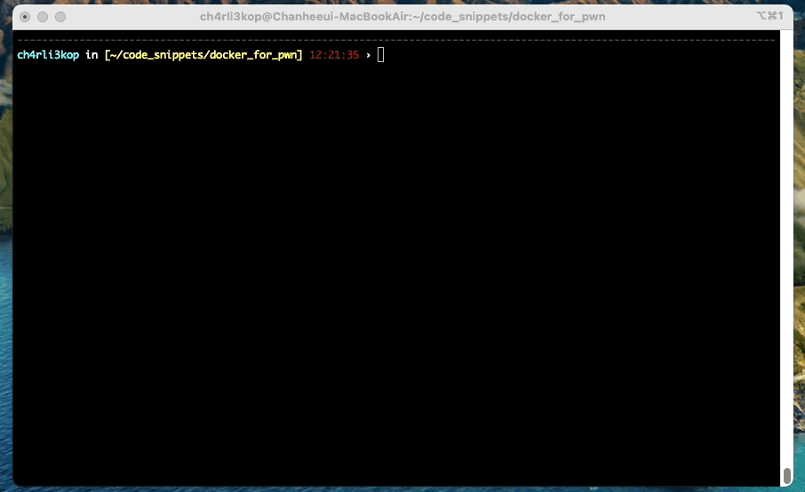

# Docker for pwn

simple pwn docker environments for CTF. These docker files are based on `ubuntu 22.04`, `ubuntu 20.04`, and `ubuntu 18.04`.



## Features

- `pwntools` - https://github.com/Gallopsled/pwntools
- `one_gadget` - https://github.com/david942j/one_gadget
- `ropper` - https://github.com/sashs/Ropper
- `rp++` - https://github.com/0vercl0k/rp
- `z3-solver` - https://github.com/Z3Prover/z3
- `angr` - https://github.com/angr/angr
- `seccomp-tools` - https://github.com/david942j/seccomp-tools
- `gdb (peda, pwndbg, gef)` - https://github.com/apogiatzis/gdb-peda-pwndbg-gef.git
- `oh my zsh` - https://github.com/deluan/zsh-in-docker
- `tmux` - https://github.com/tmux/tmux
- ...

## Usages

#### build images

```shell
$ sudo docker-compose build
```

#### Run container

```shell
$ sudo docker-compose run ctf_22
$ sudo docker-compose run ctf_20
$ sudo docker-compose run ctf_18
```


## More Information

### Structure

This repository structure is like the one below.

```shell
ch4rli3kop in [~/code_snippets/docker_for_pwn] 10:09:08 › exa -Ta
.
├── .env
├── ctf_18
│  └── Dockerfile
├── ctf_20
│  └── Dockerfile
├── ctf_22
│  └── Dockerfile
├── docker-compose.yml
└── README.md
```

### User Settings

`.env` file is a docker environment file. In this file, you can set your username and password for the docker container. And you can also set the shared volume path at `HOST_PATH` and `CONT_PATH`. These variables are used in the volume attribute of `docker-compose.yml` like `${HOST_PATH}`:`${CONT_PATH}`. All containers share the same directory.

#### .env

```bash
USERNAME=test
PASSWD=test
HOST_PATH="~/CTF"
CONT_PATH="/home/${USERNAME}/CTF"
```

### gdb

In this container, gdb all in one is installed. If you want more information, you can refer to [this site](https://github.com/apogiatzis/gdb-peda-pwndbg-gef.git). You can use `gef`, `peda`, and `pwndbg` with the below commands.

```shell
$ gdb-peda
$ gdb-peda-intel
$ gdb-peda-arm
$ gdb-pwndbg
$ gdb-gef
```
